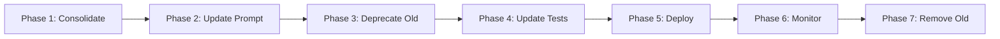

# Consolidated Project Management Tool Plan

## Overview

This plan outlines the consolidation of four separate management tools into a single unified [`ProjectManagementTool`](../leanworks/agent/tools/project_management.py). This consolidation will simplify the agent's tool ecosystem, reduce code duplication, and provide a more cohesive interface for project management operations.

## Current State Analysis

### Tools to Consolidate

1. **TaskManagementTool** ([`task_management.py`](../leanworks/agent/tools/task_management.py))
   - Methods: `query_tasks`, `create_task`, `update_task`, `query_task_progress_updates`
   - Focus: Task CRUD operations and progress tracking
   - API Endpoints: `/api/tasks`, `/api/task-progress-updates`

2. **ProjectManagementTool** ([`project_management.py`](../leanworks/agent/tools/project_management.py))
   - Methods: `query_projects`, `query_project_progress_updates`
   - Focus: Project querying and progress summaries
   - API Endpoints: `/api/projects`, `/api/project-progress-updates`

3. **EventManagementTool** ([`event_management.py`](../leanworks/agent/tools/event_management.py))
   - Methods: `query_events`
   - Focus: Calendar event querying
   - API Endpoints: `/api/events`

4. **QueryManagementTool** ([`query_management.py`](../leanworks/agent/tools/query_management.py))
   - Methods: `execute_sql_query`, `get_table_schema`
   - Focus: Direct SQL access to all project management data
   - API Endpoints: `/api/query/execute`, `/api/query/schema`

### Current Tool Count
- **Before:** 4 separate tools with 10 total methods
- **After:** 1 unified tool with all methods consolidated

## Consolidation Strategy

### Unified Tool Name: `ProjectManagementTool`

The consolidated tool will be named [`ProjectManagementTool`](../leanworks/agent/tools/project_management.py) as it represents the broadest scope of project management operations.

### Method Organization

All methods will be organized into logical categories within the single tool:

```python
class ProjectManagementTool(BaseAPIClient):
    """
    Unified project management tool for all PM operations.
    Handles tasks, projects, events, and SQL queries.
    """
    
    # ============================================================================
    # TASK MANAGEMENT
    # ============================================================================
    def query_tasks(self, **kwargs) -> List[Dict[str, Any]]:
        """Query tasks with flexible filtering."""
        
    def create_task(self, **kwargs) -> Dict[str, Any]:
        """Create a new task."""
        
    def update_task(self, taskId: str, **kwargs) -> Dict[str, Any]:
        """Update an existing task."""
        
    def query_task_progress_updates(self, **kwargs) -> List[Dict[str, Any]]:
        """Query task progress updates."""
    
    # ============================================================================
    # PROJECT MANAGEMENT
    # ============================================================================
    def query_projects(self, **kwargs) -> List[Dict[str, Any]]:
        """Query projects with flexible filtering."""
        
    def query_project_progress_updates(self, **kwargs) -> List[Dict[str, Any]]:
        """Query project progress summaries."""
    
    # ============================================================================
    # EVENT MANAGEMENT
    # ============================================================================
    def query_events(self, **kwargs) -> List[Dict[str, Any]]:
        """Query calendar events."""
    
    # ============================================================================
    # SQL QUERY OPERATIONS
    # ============================================================================
    def execute_sql_query(self, sql: str, **kwargs) -> Dict[str, Any]:
        """Execute SQL queries against project management data."""
        
    def get_table_schema(self, table: Optional[str] = None) -> Dict[str, Any]:
        """Get schema information for queryable tables."""
```

## Architecture Design

### File Structure

```
leanworks/agent/tools/
├── project_management.py          # Consolidated tool (expanded)
├── task_management.py             # DEPRECATED - kept for reference
├── event_management.py            # DEPRECATED - kept for reference
├── query_management.py            # DEPRECATED - kept for reference
└── base_api_client.py             # Unchanged
```

### Consolidated Tool Structure

```python
"""
Project Management Tool - Unified tool for all project management operations.
Handles tasks, projects, events, and SQL queries via leanworks-hub API.
"""
from typing import Dict, List, Any, Optional
from .base_api_client import BaseAPIClient
import logging

logger = logging.getLogger(__name__)


class ProjectManagementTool(BaseAPIClient):
    """
    Unified project management operations via leanworks-hub API.
    
    This tool consolidates:
    - Task management (CRUD, progress updates)
    - Project management (queries, progress summaries)
    - Event management (calendar queries)
    - SQL query operations (direct database access)
    """
    
    # Task Management Methods
    @property
    def query_tasks_property(self):
        """Query tasks with flexible filtering."""
        # [Implementation from TaskManagementTool]
    
    def query_tasks(self, **kwargs) -> List[Dict[str, Any]]:
        """Query tasks via API."""
        # [Implementation from TaskManagementTool]
    
    @property
    def create_task_property(self):
        """Create a new task."""
        # [Implementation from TaskManagementTool]
    
    def create_task(self, **kwargs) -> Dict[str, Any]:
        """Create task via API."""
        # [Implementation from TaskManagementTool]
    
    @property
    def update_task_property(self):
        """Update an existing task."""
        # [Implementation from TaskManagementTool]
    
    def update_task(self, taskId: str, **kwargs) -> Dict[str, Any]:
        """Update task via API."""
        # [Implementation from TaskManagementTool]
    
    @property
    def query_task_progress_updates_property(self):
        """Query task progress updates."""
        # [Implementation from TaskManagementTool]
    
    def query_task_progress_updates(self, **kwargs) -> List[Dict[str, Any]]:
        """Query task progress updates via API."""
        # [Implementation from TaskManagementTool]
    
    # Project Management Methods
    @property
    def query_projects_property(self):
        """Query projects with flexible filtering."""
        # [Implementation from ProjectManagementTool]
    
    def query_projects(self, **kwargs) -> List[Dict[str, Any]]:
        """Query projects via API."""
        # [Implementation from ProjectManagementTool]
    
    @property
    def query_project_progress_updates_property(self):
        """Query project progress summaries."""
        # [Implementation from ProjectManagementTool]
    
    def query_project_progress_updates(self, **kwargs) -> List[Dict[str, Any]]:
        """Query project progress summaries via API."""
        # [Implementation from ProjectManagementTool]
    
    # Event Management Methods
    @property
    def query_events_property(self):
        """Query events with flexible filtering."""
        # [Implementation from EventManagementTool]
    
    def query_events(self, **kwargs) -> List[Dict[str, Any]]:
        """Query events via API."""
        # [Implementation from EventManagementTool]
    
    # SQL Query Methods
    @property
    def execute_sql_query_property(self):
        """Execute SQL queries against project management data."""
        # [Implementation from QueryManagementTool]
    
    def execute_sql_query(self, sql: str, params: Optional[List] = None,
                         timeout: int = 30000, maxRows: int = 1000) -> Dict[str, Any]:
        """Execute SQL query via Query API."""
        # [Implementation from QueryManagementTool]
    
    @property
    def get_table_schema_property(self):
        """Get schema information for queryable tables."""
        # [Implementation from QueryManagementTool]
    
    def get_table_schema(self, table: Optional[str] = None) -> Dict[str, Any]:
        """Get table schema information via Query API."""
        # [Implementation from QueryManagementTool]
    
    # Helper Methods (from TaskManagementTool)
    def _resolve_assignee_to_email(self, assignee_input: str) -> Optional[str]:
        """Resolve assignee display name to email address."""
        # [Implementation from TaskManagementTool]
```

## Implementation Plan

### Phase 1: Consolidate Code

**Step 1: Expand ProjectManagementTool**

1. Copy all methods from `TaskManagementTool` to `ProjectManagementTool`
2. Copy all methods from `EventManagementTool` to `ProjectManagementTool`
3. Copy all methods from `QueryManagementTool` to `ProjectManagementTool`
4. Add section comments for organization
5. Update docstrings to reflect unified tool

**Step 2: Update Toolkit Integration**

Update [`toolkit.py`](../leanworks/agent/tools/toolkit.py):

```python
# Remove separate tool imports
# from leanworks.agent.tools.task_management import TaskManagementTool
# from leanworks.agent.tools.event_management import EventManagementTool
# from leanworks.agent.tools.query_management import QueryManagementTool

# Keep only unified import
from leanworks.agent.tools.project_management import ProjectManagementTool

# Update internal tools list
internal_tools = [
    'search',
    'project_management',  # Unified tool
    'user_management',
    'chat_management',
    'doc_management',
    'duckdb'
]

# Update lazy-loading property
@property
def project_management_tool(self):
    """Lazy-load unified Project Management tool on first access."""
    if 'project_management_tool' not in self._tool_cache:
        if 'project_management' in self.requested_tools and self.org_slug:
            try:
                self._tool_cache['project_management_tool'] = ProjectManagementTool(
                    org_slug=self.org_slug,
                    user_id=self.user_id
                )
                if 'project_management' not in self.enabled_tools:
                    self.enabled_tools.append('project_management')
                logger.debug("ProjectManagementTool (unified) initialized successfully (lazy)")
            except Exception as e:
                logger.error(f"Failed to initialize ProjectManagementTool: {str(e)}")
                self._tool_cache['project_management_tool'] = None
        elif 'project_management' in self.requested_tools:
            logger.warning("ProjectManagementTool not initialized: missing org_slug")
            self._tool_cache['project_management_tool'] = None
        else:
            self._tool_cache['project_management_tool'] = None
    return self._tool_cache['project_management_tool']

# Remove separate tool properties
# - task_management_tool
# - event_management_tool
# - query_management_tool

# Update tools property to register all methods
if self.project_management_tool:
    self._tools_cache.extend([
        # Task management
        self.project_management_tool.query_tasks_property,
        self.project_management_tool.create_task_property,
        self.project_management_tool.update_task_property,
        self.project_management_tool.query_task_progress_updates_property,
        # Project management
        self.project_management_tool.query_projects_property,
        self.project_management_tool.query_project_progress_updates_property,
        # Event management
        self.project_management_tool.query_events_property,
        # SQL query operations
        self.project_management_tool.execute_sql_query_property,
        self.project_management_tool.get_table_schema_property,
    ])
    logger.info("ProjectManagementTool (unified) tools added to tools list (lazy)")

# Update function_map property
if self.project_management_tool:
    self._function_map_cache.update({
        # Task management
        "query_tasks": self.project_management_tool.query_tasks,
        "create_task": self.project_management_tool.create_task,
        "update_task": self.project_management_tool.update_task,
        "query_task_progress_updates": self.project_management_tool.query_task_progress_updates,
        # Project management
        "query_projects": self.project_management_tool.query_projects,
        "query_project_progress_updates": self.project_management_tool.query_project_progress_updates,
        # Event management
        "query_events": self.project_management_tool.query_events,
        # SQL query operations
        "execute_sql_query": self.project_management_tool.execute_sql_query,
        "get_table_schema": self.project_management_tool.get_table_schema,
    })
    logger.info("ProjectManagementTool (unified) functions added to function_map (lazy)")
```

### Phase 2: Update Agent System Prompt

Update [`setting.py`](../leanworks/setting.py):

```python
<tool_calling>
You have below tools at your disposal to answer project management related questions.
Internal project collaboration tools:
- User management tools: query_users
- Document management tools: create_doc, update_doc, get_doc, list_docs, ...
- Project management tools: query_tasks, create_task, update_task, query_task_progress_updates, query_projects, query_project_progress_updates, query_events, execute_sql_query, get_table_schema
- Chat management tools: query_messages

External project collaboration tools:
...

Tool Usage Guidelines:
- Project management tools: Unified tool for all project management operations including tasks, projects, events, and SQL queries.
  * Task operations: Use query_tasks, create_task, update_task for task management
  * Project operations: Use query_projects for project queries
  * Event operations: Use query_events for calendar events
  * SQL operations: Use execute_sql_query for complex queries across multiple entities
  * Schema inspection: Use get_table_schema to understand table structures
  
  When to use SQL vs specialized methods:
  - Use execute_sql_query for: complex joins, aggregations, cross-entity analytics
  - Use specialized methods for: simple CRUD operations, standard filtering
...
```

### Phase 3: Deprecate Old Tools

**Mark old tool files as deprecated:**

1. Add deprecation notice to [`task_management.py`](../leanworks/agent/tools/task_management.py):
```python
"""
Task Management Tool - DEPRECATED

This tool has been consolidated into ProjectManagementTool.
This file is kept for reference only and will be removed in a future version.

Use ProjectManagementTool instead:
- from leanworks.agent.tools.project_management import ProjectManagementTool
"""
import warnings
warnings.warn(
    "TaskManagementTool is deprecated. Use ProjectManagementTool instead.",
    DeprecationWarning,
    stacklevel=2
)
```

2. Similar deprecation notices for:
   - [`event_management.py`](../leanworks/agent/tools/event_management.py)
   - [`query_management.py`](../leanworks/agent/tools/query_management.py)

### Phase 4: Update Tests

**Consolidate test files:**

1. Create [`tests/test_project_management_tool.py`](../tests/test_project_management_tool.py) with all tests
2. Mark old test files as deprecated:
   - `tests/test_task_management_tool.py`
   - `tests/test_query_management_tool.py`

## Benefits of Consolidation

### For Developers

1. **Reduced Complexity**
   - Single tool to maintain instead of 4
   - Unified codebase for all PM operations
   - Easier to add new features

2. **Better Code Organization**
   - Logical grouping of related methods
   - Clear section boundaries
   - Consistent patterns

3. **Simplified Testing**
   - Single test suite
   - Unified mocking strategy
   - Easier integration tests

### For AI Agent

1. **Simpler Tool Selection**
   - One tool for all PM operations
   - Clearer decision-making
   - Reduced tool switching

2. **Better Context**
   - All PM methods in one place
   - Easier to understand relationships
   - More coherent responses

3. **Improved Performance**
   - Single tool initialization
   - Shared connection pooling
   - Reduced overhead

### For Users

1. **Consistent Experience**
   - Unified interface
   - Predictable behavior
   - Better error messages

2. **Faster Responses**
   - Reduced tool switching
   - Better caching
   - Optimized queries

## Migration Timeline



### Detailed Timeline

**Week 1: Consolidation**
- Day 1-2: Consolidate code into ProjectManagementTool
- Day 3-4: Update toolkit integration
- Day 5: Update system prompt

**Week 2: Testing & Deprecation**
- Day 1-2: Update and consolidate tests
- Day 3-4: Add deprecation notices
- Day 5: Code review and refinement

**Week 3: Deployment**
- Day 1-2: Deploy to staging
- Day 3-4: Integration testing
- Day 5: Deploy to production

**Week 4: Monitoring**
- Monitor usage patterns
- Track error rates
- Collect feedback
- Fix issues

**Month 2-3: Cleanup**
- Verify no usage of old tools
- Remove deprecated files
- Update documentation
- Final cleanup

## Backward Compatibility

### Strategy

**No Breaking Changes:**
- All method names remain the same
- All parameters remain the same
- All return values remain the same
- Only the tool name changes (from multiple to one)

**Gradual Migration:**
- Old tool files kept with deprecation warnings
- Toolkit updated to use unified tool
- Agent prompt updated to reference unified tool
- Old files removed after verification period

### Compatibility Matrix

| Component | Before | After | Compatible? |
|-----------|--------|-------|-------------|
| Method Names | `query_tasks`, `query_projects`, etc. | Same | ✅ Yes |
| Parameters | Various | Same | ✅ Yes |
| Return Values | Various | Same | ✅ Yes |
| Tool Name | `TaskManagementTool`, etc. | `ProjectManagementTool` | ⚠️ Internal only |
| API Endpoints | Various | Same | ✅ Yes |

## Testing Strategy

### Unit Tests

**File:** `tests/test_project_management_tool.py`

```python
import pytest
from leanworks.agent.tools.project_management import ProjectManagementTool

class TestProjectManagementTool:
    
    @pytest.fixture
    def tool(self):
        """Create a ProjectManagementTool instance for testing."""
        return ProjectManagementTool(org_slug="test-org", user_id="test@example.com")
    
    # Task Management Tests
    def test_query_tasks(self, tool):
        """Test task querying."""
        # [Test implementation]
    
    def test_create_task(self, tool):
        """Test task creation."""
        # [Test implementation]
    
    def test_update_task(self, tool):
        """Test task updating."""
        # [Test implementation]
    
    # Project Management Tests
    def test_query_projects(self, tool):
        """Test project querying."""
        # [Test implementation]
    
    # Event Management Tests
    def test_query_events(self, tool):
        """Test event querying."""
        # [Test implementation]
    
    # SQL Query Tests
    def test_execute_sql_query(self, tool):
        """Test SQL query execution."""
        # [Test implementation]
    
    def test_get_table_schema(self, tool):
        """Test schema retrieval."""
        # [Test implementation]
```

### Integration Tests

**File:** `tests/test_project_management_integration.py`

```python
import pytest
from leanworks.agent.chat import ChatAgent

class TestProjectManagementIntegration:
    
    def test_agent_uses_unified_tool(self):
        """Test that agent uses unified ProjectManagementTool."""
        agent = ChatAgent(
            firestore_client=mock_firestore,
            secret_manager_client=mock_secret_manager,
            model_client=mock_model,
            user_id="test@example.com",
            org_slug="test-org"
        )
        
        response = agent.chat("Show me all tasks")
        
        # Verify unified tool was used
        assert 'project_management_tool' in str(agent.tool_use.enabled_tools)
        assert 'task_management_tool' not in str(agent.tool_use.enabled_tools)
```

## Implementation Checklist

### Phase 1: Consolidation
- [ ] Copy all methods from TaskManagementTool to ProjectManagementTool
- [ ] Copy all methods from EventManagementTool to ProjectManagementTool
- [ ] Copy all methods from QueryManagementTool to ProjectManagementTool
- [ ] Add section comments for organization
- [ ] Update docstrings
- [ ] Test consolidated tool

### Phase 2: Toolkit Integration
- [ ] Remove separate tool imports
- [ ] Update internal tools list
- [ ] Update lazy-loading property
- [ ] Remove separate tool properties
- [ ] Update tools registration
- [ ] Update function_map registration
- [ ] Test toolkit integration

### Phase 3: System Prompt
- [ ] Update tool list in system prompt
- [ ] Update tool usage guidelines
- [ ] Add unified tool examples
- [ ] Remove references to old tools
- [ ] Test agent with new prompt

### Phase 4: Deprecation
- [ ] Add deprecation notice to task_management.py
- [ ] Add deprecation notice to event_management.py
- [ ] Add deprecation notice to query_management.py
- [ ] Update import statements
- [ ] Test deprecation warnings

### Phase 5: Testing
- [ ] Create consolidated test file
- [ ] Port all existing tests
- [ ] Add integration tests
- [ ] Run full test suite
- [ ] Fix any failures

### Phase 6: Deployment
- [ ] Deploy to staging
- [ ] Run integration tests
- [ ] Monitor performance
- [ ] Collect feedback
- [ ] Deploy to production

### Phase 7: Cleanup
- [ ] Monitor usage for 1 month
- [ ] Verify no usage of old tools
- [ ] Remove deprecated files
- [ ] Update documentation
- [ ] Final cleanup

## Risk Mitigation

### Risk 1: Breaking Changes

**Mitigation:**
- Keep all method signatures identical
- Maintain backward compatibility
- Gradual deprecation period
- Comprehensive testing

### Risk 2: Performance Issues

**Mitigation:**
- Single tool initialization
- Shared connection pooling
- Performance testing
- Monitoring and optimization

### Risk 3: Agent Confusion

**Mitigation:**
- Clear system prompt updates
- Comprehensive tool descriptions
- Usage examples
- Gradual rollout

### Risk 4: Code Complexity

**Mitigation:**
- Clear section organization
- Comprehensive comments
- Consistent patterns
- Code review

## Success Metrics

### Technical Metrics

1. **Code Reduction**
   - Lines of code reduced by ~30%
   - Number of files reduced from 4 to 1
   - Maintenance overhead reduced

2. **Performance**
   - Tool initialization time < 100ms
   - Method execution time unchanged
   - Memory usage reduced

3. **Quality**
   - Test coverage > 90%
   - No regressions
   - Error rate < 1%

### User Experience Metrics

1. **Agent Performance**
   - Response time unchanged or improved
   - Tool selection accuracy > 95%
   - Error rate < 1%

2. **Developer Experience**
   - Easier to add new features
   - Faster bug fixes
   - Better code maintainability

## Conclusion

Consolidating the four separate management tools into a single unified [`ProjectManagementTool`](../leanworks/agent/tools/project_management.py) will:

1. **Simplify the codebase** - Reduce from 4 tools to 1
2. **Improve maintainability** - Single tool to update and test
3. **Enhance agent performance** - Clearer tool selection
4. **Maintain compatibility** - No breaking changes
5. **Reduce complexity** - Unified interface for all PM operations

The consolidation follows best practices for code organization, maintains backward compatibility, and provides a clear migration path with minimal risk.
