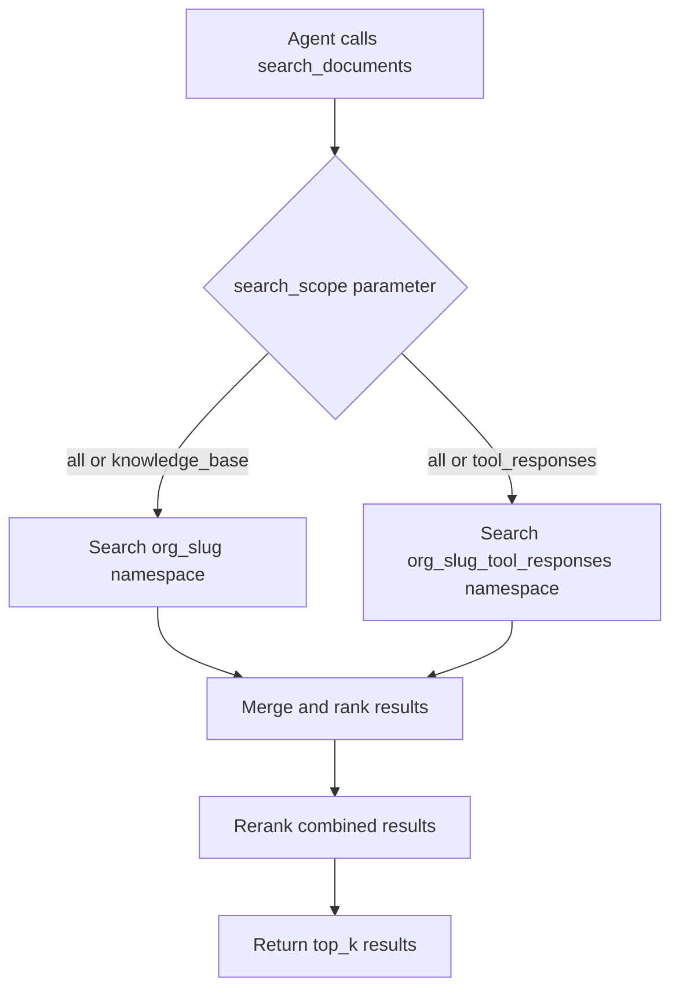

# Unified Search Tool Plan: Extending SearchTool for Tool Response Queries

## Overview

Extend the existing [`SearchTool`](../leanworks/agent/tools/search.py) to support querying both:
1. **Knowledge base documents** (existing functionality) - from data sources like Confluence, Jira, GitHub, etc.
2. **Stored tool responses** (new functionality) - large responses automatically saved to vector DB

This eliminates the need for a separate RAG storage tool while providing a unified search interface for agents.

## Current Architecture Analysis

### SearchTool Structure
- **Location**: [`leanworks/agent/tools/search.py`](../leanworks/agent/tools/search.py)
- **Vector DB**: Uses `PineconeHybridIndex` with shared indexes (`leanworks-dense`, `leanworks-sparse`)
- **Namespace**: Currently uses `org_slug` as namespace (e.g., `"leanworks.ai"`)
- **Search Method**: [`async_search_documents`](../leanworks/agent/tools/search.py:188) via [`AsyncChat.retrieve_nodes`](../leanworks/rag/chat.py:156)
- **Filters**: Supports `data_source`, `start_date`, `end_date` filters

### RAGStorageTool Structure
- **Location**: [`leanworks/agent/tools/rag_storage.py`](../leanworks/agent/tools/rag_storage.py)
- **Namespace**: Uses `f"{org_slug}_tool_responses"` (e.g., `"leanworks.ai_tool_responses"`)
- **Storage Method**: [`store_tool_response_in_vectorstore`](../leanworks/agent/tools/rag_storage.py:33) - stores chunked tool responses
- **Search Method**: [`search_tool_response_in_vectorstore`](../leanworks/agent/tools/rag_storage.py:145) - searches stored responses
- **Metadata**: Stores `type: "tool_response"`, `tool_name`, `tool_input`, `document_id`, `timestamp`

### Key Insight
Both tools use the **same Pinecone indexes** but **different namespaces**:
- Knowledge base: `{org_slug}` namespace
- Tool responses: `{org_slug}_tool_responses` namespace

## Design: Unified Search Approach

### Option 1: Multi-Namespace Search (Recommended)

Search both namespaces and merge results based on relevance scores.



**Advantages:**
- Clean separation of concerns
- Can search either or both namespaces
- Maintains existing metadata structure
- Easy to filter by source type

**Implementation:**
- Add `search_scope` parameter: `"all"`, `"knowledge_base"`, `"tool_responses"`
- Perform parallel searches when scope is `"all"`
- Merge results using RRF (Reciprocal Rank Fusion) or score normalization
- Add `source_type` to results metadata

### Option 2: Single Namespace with Type Filter

Migrate tool responses to main namespace with `type` metadata filter.

**Disadvantages:**
- Requires data migration
- Mixes different data types in same namespace
- More complex cleanup (can't delete namespace for tool responses only)
- Not recommended

## Implementation Plan

### 1. Extend SearchTool Class

**File**: [`leanworks/agent/tools/search.py`](../leanworks/agent/tools/search.py)

#### Changes to `__init__`:
```python
def __init__(self, firestore_client, org_slug, secret_manager_client, 
             read_document_ids: set | None = None, 
             credential_path: str = "gcp_credential.json"):
    # ... existing code ...
    
    # Store org_slug for namespace calculations
    self.org_slug = org_slug
    self.tool_responses_namespace = f"{org_slug}_tool_responses"
```

#### New Method: `_search_namespace`:
```python
async def _search_namespace(
    self, 
    queries: List[str], 
    namespace: str, 
    top_k: int, 
    filters: dict = None
) -> List[Dict[str, Any]]:
    """
    Search a specific namespace with given queries.
    
    Args:
        queries: List of query strings (original + rewrites)
        namespace: Pinecone namespace to search
        top_k: Number of results to retrieve
        filters: Optional metadata filters
        
    Returns:
        List of search results with metadata
    """
    loop = asyncio.get_event_loop()
    nodes = await loop.run_in_executor(
        None,
        lambda: self.chat.retrieve_nodes(
            queries, 
            top_k=top_k, 
            filters=filters,
            namespace=namespace  # Pass namespace explicitly
        )
    )
    return nodes
```

#### Modified Method: `async_search_documents`:
```python
async def async_search_documents(
    self, 
    query: str, 
    data_source: str = None, 
    start_date: str = None, 
    end_date: str = None,
    search_scope: str = "all",  # NEW PARAMETER
    tool_name: str = None  # NEW PARAMETER for filtering tool responses
):
    """
    Search for documents across knowledge base and/or tool responses.
    
    Args:
        query: Search query
        data_source: Filter by data source (knowledge base only)
        start_date: Filter by start date
        end_date: Filter by end date
        search_scope: "all", "knowledge_base", or "tool_responses"
        tool_name: Filter tool responses by tool name (tool_responses only)
    """
    # Generate query rewrites
    rewrites_task = asyncio.create_task(self.chat.async_rewrite_query(query))
    await asyncio.gather(rewrites_task)
    
    all_queries = [query]
    try:
        rewrites = rewrites_task.result()
        all_queries.extend(rewrites)
    except Exception as e:
        logger.error(f"Error getting query rewrites: {e}")
    
    # Prepare search tasks based on scope
    search_tasks = []
    
    if search_scope in ["all", "knowledge_base"]:
        # Build filters for knowledge base
        kb_filters = {}
        if data_source:
            kb_filters["data_source"] = {"$eq": data_source}
        if start_date or end_date:
            kb_filters["timestamp"] = self._build_timestamp_filter(start_date, end_date)
        
        # Search knowledge base namespace
        kb_task = self._search_namespace(
            all_queries,
            self.org_slug,  # Main namespace
            top_k=RETRIEVE_TOP_K,
            filters=kb_filters
        )
        search_tasks.append(("knowledge_base", kb_task))
    
    if search_scope in ["all", "tool_responses"]:
        # Build filters for tool responses
        tr_filters = {"type": {"$eq": "tool_response"}}
        if tool_name:
            tr_filters["tool_name"] = {"$eq": tool_name}
        if start_date or end_date:
            tr_filters["timestamp"] = self._build_timestamp_filter(start_date, end_date)
        
        # Search tool responses namespace
        tr_task = self._search_namespace(
            all_queries,
            self.tool_responses_namespace,
            top_k=RETRIEVE_TOP_K,
            filters=tr_filters
        )
        search_tasks.append(("tool_responses", tr_task))
    
    # Execute searches in parallel
    results_by_source = {}
    for source_type, task in search_tasks:
        try:
            results = await task
            results_by_source[source_type] = results
        except Exception as e:
            logger.error(f"Error searching {source_type}: {e}")
            results_by_source[source_type] = []
    
    # Merge results if searching both
    if len(results_by_source) > 1:
        merged_nodes = self._merge_search_results(results_by_source)
    else:
        merged_nodes = list(results_by_source.values())[0]
    
    # Continue with existing postprocessing (reranking, deduplication, etc.)
    # ... rest of existing code ...
```

#### New Method: `_merge_search_results`:
```python
def _merge_search_results(
    self, 
    results_by_source: Dict[str, List]
) -> List:
    """
    Merge results from multiple namespaces using Reciprocal Rank Fusion.
    
    Args:
        results_by_source: Dict mapping source_type to list of results
        
    Returns:
        Merged and ranked list of results
    """
    from collections import defaultdict
    
    # RRF scoring: score = sum(1 / (k + rank)) for each source
    k = 60  # RRF constant
    rrf_scores = defaultdict(float)
    all_results = {}
    
    for source_type, results in results_by_source.items():
        for rank, result in enumerate(results.matches if hasattr(results, 'matches') else results, start=1):
            result_id = result.id
            rrf_scores[result_id] += 1.0 / (k + rank)
            
            # Store result with source type metadata
            if result_id not in all_results:
                # Add source_type to metadata
                if hasattr(result, 'metadata'):
                    result.metadata['source_type'] = source_type
                all_results[result_id] = result
    
    # Sort by RRF score
    sorted_results = sorted(
        all_results.values(),
        key=lambda x: rrf_scores[x.id],
        reverse=True
    )
    
    # Return as SimpleNamespace to match expected format
    from types import SimpleNamespace
    return SimpleNamespace(matches=sorted_results)
```

### 2. Update AsyncChat.retrieve_nodes

**File**: [`leanworks/rag/chat.py`](../leanworks/rag/chat.py)

Modify [`retrieve_nodes`](../leanworks/rag/chat.py:156) to accept optional `namespace` parameter:

```python
def retrieve_nodes(
    self, 
    query: str | List[str], 
    top_k: int, 
    filters: dict = None, 
    alpha: float = ALPHA,
    namespace: str = None  # NEW PARAMETER
) -> SimpleNamespace:
    """
    Retrieve relevant context using hybrid search.
    
    Args:
        query: The user query or list of queries
        top_k: Number of context chunks to retrieve
        filters: Dictionary of filters to apply
        alpha: Hybrid search alpha parameter
        namespace: Optional namespace override (defaults to self.org_slug)
    """
    queries = [query] if isinstance(query, str) else query
    if not queries:
        return SimpleNamespace(matches=[])
    
    # Use provided namespace or default to org_slug
    search_namespace = namespace if namespace is not None else self.org_slug
    
    all_matches = []
    for q in queries:
        hybrid_results = self.vectordb_client.hybrid_search(
            query=q,
            top_k=top_k,
            alpha=alpha,
            namespace=search_namespace,  # Use the namespace parameter
            filter=filters
        )
        # ... rest of existing code ...
```

### 3. Update Tool Definition

**File**: [`leanworks/agent/tools/search.py`](../leanworks/agent/tools/search.py)

Update [`search_documents_property`](../leanworks/agent/tools/search.py:142):

```python
@property
def search_documents_property(self):
    description = """
    Search for relevant information using the team's knowledge base and stored tool responses.
    
    This tool searches across two types of content:
    1. Knowledge base documents (Confluence, Jira, GitHub, Slack, etc.)
    2. Stored tool responses (large outputs from previous tool executions)
    
    The response will be a list of results ordered by relevance, most relevant first.
    
    Use this tool when:
    - Other tools are not suitable to answer the question
    - Other tools return empty, error or insufficient results
    - You need to find information from previous tool responses
    - You have ANY uncertainty about the quality of your answer
    - More detailed information is needed
    
    You might need to use this tool multiple times with different queries or scopes.
    """
    return {
        "type": "custom",
        "name": "search_documents",
        "description": description,
        "input_schema": {
            "type": "object",
            "properties": {
                "query": {
                    "type": "string",
                    "description": "Query to search for relevant information"
                },
                "search_scope": {
                    "type": "string",
                    "enum": ["all", "knowledge_base", "tool_responses"],
                    "description": "Scope of search: 'all' (default) searches both knowledge base and tool responses, 'knowledge_base' searches only documents, 'tool_responses' searches only stored tool outputs",
                    "default": "all"
                },
                "data_source": {
                    "type": "string",
                    "description": "Optional data source filter (knowledge_base only). One of: confluence, jira, gitlab_issue, gitlab_commits, github_commits, slack, teams, notion, google_doc, google_sheet, servicenow"
                },
                "tool_name": {
                    "type": "string",
                    "description": "Optional tool name filter (tool_responses only). Filter results to specific tool outputs"
                },
                "start_date": {
                    "type": "string",
                    "description": "Optional start date for filtering by timestamp (YYYY-MM-DD)"
                },
                "end_date": {
                    "type": "string",
                    "description": "Optional end date for filtering by timestamp (YYYY-MM-DD)"
                }
            },
            "required": ["query"]
        }
    }
```

### 4. Remove RAGStorageTool Tool Definitions

**File**: [`leanworks/agent/tools/rag_storage.py`](../leanworks/agent/tools/rag_storage.py)

Remove the tool definition properties added earlier:
- Remove `store_tool_response_property`
- Remove `search_tool_response_property`

Keep the class methods for internal use:
- [`store_tool_response_in_vectorstore`](../leanworks/agent/tools/rag_storage.py:33) - still used by background indexing
- [`search_tool_response_in_vectorstore`](../leanworks/agent/tools/rag_storage.py:145) - can be deprecated or kept for direct API use
- [`cleanup_session_data`](../leanworks/agent/tools/rag_storage.py:178) - still needed for cleanup

### 5. Update Toolkit Integration

**File**: [`leanworks/agent/tools/toolkit.py`](../leanworks/agent/tools/toolkit.py)

No changes needed - [`SearchTool`](../leanworks/agent/tools/search.py) is already integrated and will automatically support the new functionality.

## Backward Compatibility

### Existing Behavior Preserved
- Default `search_scope="all"` maintains current behavior plus tool responses
- All existing parameters (`data_source`, `start_date`, `end_date`) work as before
- Existing code calling `search_documents` without new parameters continues to work

### Migration Path
1. Deploy updated [`SearchTool`](../leanworks/agent/tools/search.py) with new parameters
2. Existing tool response data in `{org_slug}_tool_responses` namespace is immediately searchable
3. No data migration required
4. [`RAGStorageTool`](../leanworks/agent/tools/rag_storage.py) continues to work for storage operations

## Testing Strategy

### Unit Tests
1. Test `_search_namespace` with different namespaces
2. Test `_merge_search_results` with various result combinations
3. Test `search_scope` parameter handling
4. Test filter combinations (data_source + tool_name)

### Integration Tests
1. Search knowledge base only (`search_scope="knowledge_base"`)
2. Search tool responses only (`search_scope="tool_responses"`)
3. Search both (`search_scope="all"`) and verify merged results
4. Test with tool_name filter
5. Test with date range filters across both namespaces
6. Verify deduplication works across namespaces

### Performance Tests
1. Measure latency of parallel namespace searches
2. Verify RRF merging doesn't significantly impact response time
3. Test with large result sets

## Benefits

1. **Unified Interface**: Single tool for all search needs
2. **Automatic Discovery**: Agents can find tool responses without knowing they exist
3. **Flexible Filtering**: Can search specific scopes or combine results
4. **No Breaking Changes**: Fully backward compatible
5. **Clean Architecture**: Leverages existing infrastructure
6. **Efficient**: Parallel searches minimize latency

## Future Enhancements

1. **Weighted Merging**: Allow different weights for knowledge base vs tool responses
2. **Smart Scope Selection**: LLM-based automatic scope determination
3. **Cross-Reference Detection**: Identify when tool responses reference knowledge base docs
4. **Response Summarization**: Automatically summarize large tool responses in search results
5. **Temporal Ranking**: Boost recent tool responses for time-sensitive queries
