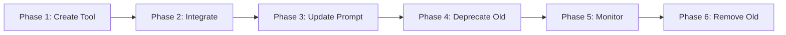

# Unified SQL Query Tool Integration Plan

## Overview

This plan outlines the integration of two new unified SQL query tools from leanworks-hub that will replace the existing specialized query tools for tasks, projects, events, and users. The new tools provide direct SQL access to project management data, offering more flexibility and reducing code duplication.

## Current State Analysis

### Existing Query Tools (To Be Deprecated)

The following domain-specific query tools currently exist in the leanworks agent:

1. **TaskManagementTool** ([`task_management.py`](../leanworks/agent/tools/task_management.py))
   - `query_tasks()` - Queries tasks with 20+ filter parameters
   - `query_task_progress_updates()` - Queries task progress updates
   - Uses REST API: `GET /api/tasks`

2. **ProjectManagementTool** ([`project_management.py`](../leanworks/agent/tools/project_management.py))
   - `query_projects()` - Queries projects with filters
   - `query_project_progress_updates()` - Queries project progress summaries
   - Uses REST API: `GET /api/projects`

3. **EventManagementTool** ([`event_management.py`](../leanworks/agent/tools/event_management.py))
   - `query_events()` - Queries calendar events
   - Uses REST API: `GET /api/events`

4. **UserManagementTool** ([`user_management.py`](../leanworks/agent/tools/user_management.py))
   - `query_users()` - Queries organization users
   - Uses REST API: `GET /api/users`

### New Unified Query APIs (From leanworks-hub)

Two new APIs are available in leanworks-hub:

1. **POST /api/query/execute** - Execute SQL queries
   - Direct SQL query execution with parameterization
   - Read-only (SELECT, WITH/CTE only)
   - Security: SQL injection protection, table whitelist, rate limiting
   - Resource limits: 60s timeout, 10K rows max, 10K chars max
   - Returns: `{success, data, metadata}`

2. **GET /api/query/schema** - Get table schemas
   - Returns column definitions for allowed tables
   - Helps agent construct valid SQL queries
   - Can query specific table or all tables

### Allowed Tables

The following tables are accessible via the query API (docs excluded):

| Table | Description |
|-------|-------------|
| `users` | Organization user profiles and roles |
| `tasks` | Task management data including status, priority, and assignments |
| `projects` | Project information and metadata |
| `task_progress_updates` | Task update history and progress notes |
| `task_comments` | Comments and discussions on tasks |
| `project_progress_updates` | Project update summaries |
| `project_members` | Project membership and roles |
| `project_comments` | Comments and discussions on projects |
| `events` | Calendar events and meetings |

**Note:** The `docs` table is intentionally excluded from the query API as document management has its own specialized tools.

## Architecture Design

### New Tool: QueryManagementTool

Create a new tool class that wraps the unified SQL query APIs:

```
leanworks/agent/tools/query_management.py
```

**Key Features:**
- Extends [`BaseAPIClient`](../leanworks/agent/tools/base_api_client.py) for consistent API communication
- Two main methods:
  - `execute_sql_query()` - Execute SQL queries
  - `get_table_schema()` - Get schema information
- Automatic error handling and rate limit management
- Query validation and sanitization
- Metadata tracking (execution time, row count)

### Tool Properties

#### 1. execute_sql_query

```python
@property
def execute_sql_query_property(self):
    return {
        "type": "custom",
        "name": "execute_sql_query",
        "description": """
Execute SQL queries against project management data.

Use this tool to query tasks, projects, events, users, and related data using SQL.
This provides flexible querying capabilities for complex data retrieval needs.

Parameters:
- sql (required): SQL SELECT or WITH query (max 10,000 characters)
- params: Array of parameterized query values (default: [])
- timeout: Query timeout in milliseconds (1000-60000, default: 30000)
- maxRows: Maximum rows to return (1-10000, default: 1000)

Available Tables:
- users: Organization user profiles and roles
- tasks: Task management data (status, priority, assignments)
- projects: Project information and metadata
- task_progress_updates: Task update history
- task_comments: Comments on tasks
- project_progress_updates: Project update summaries
- project_members: Project membership and roles
- project_comments: Comments on projects
- events: Calendar events and meetings

Security:
- Only SELECT and WITH (CTE) queries allowed
- Parameterized queries recommended for dynamic values
- Rate limited: 100 queries per 15 minutes

Examples:
- execute_sql_query(sql="SELECT * FROM tasks WHERE status = 'completed' LIMIT 10")
- execute_sql_query(sql="SELECT * FROM tasks WHERE assignee_id = $1", params=["user@example.com"])
- execute_sql_query(sql="SELECT p.name, COUNT(t.id) as task_count FROM projects p LEFT JOIN tasks t ON p.id = t.project_id GROUP BY p.id, p.name")

Best Practices:
- Use LIMIT clauses to control result size
- Use parameterized queries ($1, $2) for dynamic values
- Check schema first for complex queries
- Use appropriate timeouts for complex queries
        """,
        "input_schema": {
            "type": "object",
            "properties": {
                "sql": {
                    "type": "string",
                    "description": "SQL SELECT or WITH query (max 10,000 characters)"
                },
                "params": {
                    "type": "array",
                    "items": {"type": ["string", "number", "boolean", "null"]},
                    "description": "Parameterized query values (default: [])"
                },
                "timeout": {
                    "type": "integer",
                    "description": "Query timeout in milliseconds (1000-60000, default: 30000)",
                    "minimum": 1000,
                    "maximum": 60000
                },
                "maxRows": {
                    "type": "integer",
                    "description": "Maximum rows to return (1-10000, default: 1000)",
                    "minimum": 1,
                    "maximum": 10000
                }
            },
            "required": ["sql"]
        }
    }
```

#### 2. get_table_schema

```python
@property
def get_table_schema_property(self):
    return {
        "type": "custom",
        "name": "get_table_schema",
        "description": """
Get schema information for queryable tables.

Use this tool to understand table structures before writing SQL queries.
Returns column names, data types, nullability, and defaults.

Parameters:
- table: Specific table name to get schema for (optional)

If table is specified, returns detailed column information.
If table is omitted, returns list of all available tables.

Available Tables:
- users, tasks, projects, events
- task_progress_updates, task_comments
- project_progress_updates, project_members, project_comments

Examples:
- get_table_schema() - List all available tables
- get_table_schema(table="tasks") - Get detailed schema for tasks table
- get_table_schema(table="users") - Get detailed schema for users table
        """,
        "input_schema": {
            "type": "object",
            "properties": {
                "table": {
                    "type": "string",
                    "description": "Specific table name to get schema for (optional)"
                }
            }
        }
    }
```

## Implementation Plan

### Phase 1: Create New Query Tool

**File:** `leanworks/agent/tools/query_management.py`

```python
"""
Query Management Tool - Unified SQL query tool for project management data.
Provides direct SQL access to tasks, projects, events, users, and related tables.
"""
from typing import Dict, List, Any, Optional
from .base_api_client import BaseAPIClient
import logging

logger = logging.getLogger(__name__)


class QueryManagementTool(BaseAPIClient):
    """Unified SQL query operations via leanworks-hub Query API."""
    
    @property
    def execute_sql_query_property(self):
        # [Implementation as designed above]
        pass
    
    def execute_sql_query(self, sql: str, params: Optional[List] = None, 
                         timeout: int = 30000, maxRows: int = 1000) -> Dict[str, Any]:
        """
        Execute SQL query via Query API.
        
        Args:
            sql: SQL SELECT or WITH query
            params: Parameterized query values
            timeout: Query timeout in milliseconds
            maxRows: Maximum rows to return
            
        Returns:
            Dictionary with success, data, and metadata
        """
        try:
            payload = {
                "sql": sql,
                "params": params or [],
                "options": {
                    "timeout": timeout,
                    "maxRows": maxRows,
                    "includeMetadata": True
                }
            }
            
            result = self._make_request('POST', '/api/query/execute', json=payload)
            
            if result.get('success'):
                logger.info(f"execute_sql_query successful: {result.get('metadata', {}).get('rowCount', 0)} rows")
                return result
            else:
                logger.error(f"execute_sql_query failed: {result.get('error', {}).get('message')}")
                return result
                
        except Exception as e:
            logger.error(f"execute_sql_query exception: {str(e)}")
            return {
                "success": False,
                "error": {
                    "code": "EXECUTION_ERROR",
                    "message": str(e)
                }
            }
    
    @property
    def get_table_schema_property(self):
        # [Implementation as designed above]
        pass
    
    def get_table_schema(self, table: Optional[str] = None) -> Dict[str, Any]:
        """
        Get table schema information via Query API.
        
        Args:
            table: Specific table name (optional)
            
        Returns:
            Dictionary with schema information
        """
        try:
            params = {"table": table} if table else {}
            result = self._make_request('GET', '/api/query/schema', params=params)
            
            if result.get('success'):
                logger.info(f"get_table_schema successful for table: {table or 'all'}")
                return result
            else:
                logger.error(f"get_table_schema failed: {result.get('error', {}).get('message')}")
                return result
                
        except Exception as e:
            logger.error(f"get_table_schema exception: {str(e)}")
            return {
                "success": False,
                "error": {
                    "code": "EXECUTION_ERROR",
                    "message": str(e)
                }
            }
```

### Phase 2: Integrate into Toolkit

**File:** [`leanworks/agent/tools/toolkit.py`](../leanworks/agent/tools/toolkit.py)

**Changes:**

1. **Import the new tool:**
```python
from leanworks.agent.tools.query_management import QueryManagementTool
```

2. **Add to internal tools list:**
```python
internal_tools = [
    'search',
    'query_management',  # NEW
    'task_management',
    'project_management',
    'event_management',
    'user_management',
    'chat_management',
    'doc_management',
    'duckdb'
]
```

3. **Add lazy-loading property:**
```python
@property
def query_management_tool(self):
    """Lazy-load Query Management tool on first access."""
    if 'query_management_tool' not in self._tool_cache:
        if 'query_management' in self.requested_tools and self.org_slug:
            try:
                self._tool_cache['query_management_tool'] = QueryManagementTool(
                    org_slug=self.org_slug,
                    user_id=self.user_id
                )
                if 'query_management' not in self.enabled_tools:
                    self.enabled_tools.append('query_management')
                logger.debug("QueryManagementTool initialized successfully (lazy)")
            except Exception as e:
                logger.error(f"Failed to initialize QueryManagementTool: {str(e)}")
                self._tool_cache['query_management_tool'] = None
        elif 'query_management' in self.requested_tools:
            logger.warning("QueryManagementTool not initialized: missing org_slug")
            self._tool_cache['query_management_tool'] = None
        else:
            self._tool_cache['query_management_tool'] = None
    return self._tool_cache['query_management_tool']
```

4. **Register tools in tools property:**
```python
# Add to the tools list generation
if self.query_management_tool:
    tools.append(self.query_management_tool.execute_sql_query_property)
    tools.append(self.query_management_tool.get_table_schema_property)
```

### Phase 3: Update Agent System Prompt

**File:** [`leanworks/setting.py`](../leanworks/setting.py)

**Changes to AGENT_SYSTEM_PROMPT:**

1. **Add new query tools to tool list:**
```python
<tool_calling>
You have below tools at your disposal to answer project management related questions.
Internal project collaboration tools:
- User management tools: query_users
- Document management tools: create_doc, update_doc, get_doc, list_docs, ...
- Task management tools: query_tasks, create_task, update_task, query_task_progress_updates
- Project management tools: query_projects, query_project_progress_updates
- Chat management tools: query_messages
- Event management tools: query_events
- Query tools: execute_sql_query, get_table_schema  # NEW

...
```

2. **Add query tool usage guidelines:**
```python
Tool Usage Guidelines:
- Query tools: Use execute_sql_query for flexible data retrieval across tasks, projects, events, and users. 
  Call get_table_schema first when you need to understand table structure for complex queries.
  Prefer specialized query tools (query_tasks, query_projects, etc.) for simple queries.
  Use SQL query tool for:
    * Complex joins across multiple tables
    * Aggregations and analytics
    * Custom filtering not supported by specialized tools
    * Cross-entity queries (e.g., tasks + projects + users)
- Document management tools: Always call the appropriate instruction tool first...
...
```

### Phase 4: Deprecate Old Query Methods (Gradual Approach)

**Strategy:** Keep existing query methods but mark as deprecated. Remove in future version.

**Changes to existing tools:**

1. **TaskManagementTool** - Add deprecation notice to `query_tasks`:
```python
@property
def query_tasks_property(self):
    return {
        "type": "custom",
        "name": "query_tasks",
        "description": """
Query tasks with flexible filtering.

NOTE: For complex queries or joins with other tables, consider using execute_sql_query instead.

Parameters:
...
```

2. **Similar changes for:**
   - `ProjectManagementTool.query_projects`
   - `EventManagementTool.query_events`
   - `UserManagementTool.query_users`

**Keep these methods for:**
- Simple, single-table queries
- Backward compatibility
- Ease of use for common operations
- Non-technical users who prefer high-level APIs

### Phase 5: Update Agent Instructions

**File:** [`leanworks/setting.py`](../leanworks/setting.py)

Add new section to system prompt:

```python
<sql_query_guidelines>
When to use execute_sql_query vs specialized query tools:

USE execute_sql_query when:
- Joining multiple tables (tasks + projects, tasks + users, etc.)
- Complex aggregations (COUNT, SUM, AVG, GROUP BY)
- Advanced filtering not supported by specialized tools
- Analytics and reporting queries
- Cross-entity queries requiring data from multiple sources

USE specialized query tools (query_tasks, query_projects, etc.) when:
- Simple single-table queries
- Standard filtering by common fields
- Quick lookups by ID or status
- User prefers simpler interface

SQL Query Best Practices:
1. Always use LIMIT clause to control result size
2. Use parameterized queries ($1, $2) for dynamic values
3. Call get_table_schema first for complex queries
4. Use appropriate timeout for complex queries
5. Handle rate limits gracefully (100 queries per 15 min)
6. Check for truncated results in metadata

Example Queries:
- Tasks by project: "SELECT t.*, p.name as project_name FROM tasks t JOIN projects p ON t.project_id = p.id WHERE p.name = $1"
- User workload: "SELECT assignee_id, COUNT(*) as task_count FROM tasks WHERE status != 'completed' GROUP BY assignee_id"
- Project progress: "SELECT p.name, COUNT(t.id) as total_tasks, SUM(CASE WHEN t.status = 'completed' THEN 1 ELSE 0 END) as completed FROM projects p LEFT JOIN tasks t ON p.id = t.project_id GROUP BY p.id, p.name"
</sql_query_guidelines>
```

## Migration Strategy

### Timeline



### Rollout Phases

1. **Week 1-2: Implementation**
   - Create QueryManagementTool
   - Integrate into toolkit
   - Update system prompt
   - Add deprecation notices

2. **Week 3-4: Testing**
   - Unit tests for new tool
   - Integration tests with agent
   - Performance testing
   - Rate limit testing

3. **Week 5-6: Gradual Rollout**
   - Deploy to staging
   - Monitor usage patterns
   - Collect feedback
   - Fix issues

4. **Week 7-8: Full Deployment**
   - Deploy to production
   - Monitor error rates
   - Track query performance
   - Document common patterns

5. **Month 3+: Deprecation**
   - Analyze usage of old vs new tools
   - Plan removal of deprecated methods
   - Communicate deprecation timeline
   - Remove old query methods

### Backward Compatibility

**Keep existing tools functional:**
- TaskManagementTool.query_tasks
- ProjectManagementTool.query_projects
- EventManagementTool.query_events
- UserManagementTool.query_users

**Reasons:**
1. Existing code/scripts may depend on them
2. Simpler interface for common queries
3. Gradual migration reduces risk
4. User preference for high-level APIs

**Deprecation path:**
1. Add deprecation notices (Phase 4)
2. Monitor usage for 3-6 months
3. Announce removal timeline
4. Remove in major version update

## Testing Strategy

### Unit Tests

**File:** `tests/test_query_management_tool.py`

```python
import pytest
from leanworks.agent.tools.query_management import QueryManagementTool

class TestQueryManagementTool:
    
    def test_execute_sql_query_success(self):
        """Test successful SQL query execution"""
        tool = QueryManagementTool(org_slug="test-org", user_id="test@example.com")
        result = tool.execute_sql_query(
            sql="SELECT * FROM tasks WHERE status = $1 LIMIT 5",
            params=["completed"]
        )
        assert result['success'] == True
        assert 'data' in result
        assert 'metadata' in result
    
    def test_execute_sql_query_invalid_sql(self):
        """Test SQL query with forbidden keywords"""
        tool = QueryManagementTool(org_slug="test-org", user_id="test@example.com")
        result = tool.execute_sql_query(sql="DELETE FROM tasks")
        assert result['success'] == False
        assert result['error']['code'] == 'VALIDATION_ERROR'
    
    def test_execute_sql_query_timeout(self):
        """Test query timeout handling"""
        tool = QueryManagementTool(org_slug="test-org", user_id="test@example.com")
        result = tool.execute_sql_query(
            sql="SELECT * FROM tasks",
            timeout=1  # Very short timeout
        )
        # Should either succeed quickly or timeout gracefully
        assert 'success' in result
    
    def test_get_table_schema_all(self):
        """Test getting all table schemas"""
        tool = QueryManagementTool(org_slug="test-org", user_id="test@example.com")
        result = tool.get_table_schema()
        assert result['success'] == True
        assert 'tables' in result['data']
    
    def test_get_table_schema_specific(self):
        """Test getting specific table schema"""
        tool = QueryManagementTool(org_slug="test-org", user_id="test@example.com")
        result = tool.get_table_schema(table="tasks")
        assert result['success'] == True
        assert result['data']['table'] == 'tasks'
        assert 'columns' in result['data']
    
    def test_parameterized_query(self):
        """Test parameterized query execution"""
        tool = QueryManagementTool(org_slug="test-org", user_id="test@example.com")
        result = tool.execute_sql_query(
            sql="SELECT * FROM tasks WHERE assignee_id = $1 AND status = $2",
            params=["user@example.com", "in-progress"]
        )
        assert result['success'] == True
    
    def test_complex_join_query(self):
        """Test complex join query"""
        tool = QueryManagementTool(org_slug="test-org", user_id="test@example.com")
        sql = """
            SELECT t.*, p.name as project_name, u.first_name, u.last_name
            FROM tasks t
            LEFT JOIN projects p ON t.project_id = p.id
            LEFT JOIN users u ON t.assignee_id = u.email
            WHERE t.status = 'in-progress'
            LIMIT 10
        """
        result = tool.execute_sql_query(sql=sql)
        assert result['success'] == True
```

### Integration Tests

**File:** `tests/test_query_tool_integration.py`

```python
import pytest
from leanworks.agent.chat import ChatAgent

class TestQueryToolIntegration:
    
    def test_agent_uses_sql_query_for_complex_request(self):
        """Test that agent uses SQL query for complex multi-table requests"""
        agent = ChatAgent(
            firestore_client=mock_firestore,
            secret_manager_client=mock_secret_manager,
            model_client=mock_model,
            user_id="test@example.com",
            org_slug="test-org"
        )
        
        response = agent.chat("Show me all tasks with their project names and assignee names")
        
        # Verify SQL query tool was used
        assert any('execute_sql_query' in str(call) for call in agent.tool_calls)
    
    def test_agent_uses_specialized_tool_for_simple_request(self):
        """Test that agent uses specialized tool for simple requests"""
        agent = ChatAgent(
            firestore_client=mock_firestore,
            secret_manager_client=mock_secret_manager,
            model_client=mock_model,
            user_id="test@example.com",
            org_slug="test-org"
        )
        
        response = agent.chat("Show me all completed tasks")
        
        # Verify specialized tool was used (simpler for this case)
        assert any('query_tasks' in str(call) for call in agent.tool_calls)
```

### Performance Tests

**File:** `tests/test_query_performance.py`

```python
import pytest
import time
from leanworks.agent.tools.query_management import QueryManagementTool

class TestQueryPerformance:
    
    def test_simple_query_performance(self):
        """Test simple query performance"""
        tool = QueryManagementTool(org_slug="test-org", user_id="test@example.com")
        
        start = time.time()
        result = tool.execute_sql_query("SELECT * FROM tasks LIMIT 100")
        duration = time.time() - start
        
        assert result['success'] == True
        assert duration < 5.0  # Should complete in under 5 seconds
    
    def test_complex_query_performance(self):
        """Test complex query performance"""
        tool = QueryManagementTool(org_slug="test-org", user_id="test@example.com")
        
        sql = """
            SELECT p.name, 
                   COUNT(t.id) as total_tasks,
                   SUM(CASE WHEN t.status = 'completed' THEN 1 ELSE 0 END) as completed_tasks
            FROM projects p
            LEFT JOIN tasks t ON p.id = t.project_id
            GROUP BY p.id, p.name
            ORDER BY total_tasks DESC
        """
        
        start = time.time()
        result = tool.execute_sql_query(sql=sql)
        duration = time.time() - start
        
        assert result['success'] == True
        assert duration < 10.0  # Complex queries should complete in under 10 seconds
    
    def test_rate_limit_handling(self):
        """Test rate limit handling"""
        tool = QueryManagementTool(org_slug="test-org", user_id="test@example.com")
        
        # Make 101 requests (exceeds 100 per 15 min limit)
        results = []
        for i in range(101):
            result = tool.execute_sql_query("SELECT * FROM tasks LIMIT 1")
            results.append(result)
        
        # Last request should be rate limited
        assert results[-1]['success'] == False
        assert results[-1]['error']['code'] == 'RATE_LIMIT_EXCEEDED'
```

## Security Considerations

### Query Validation

The leanworks-hub Query API implements multiple security layers:

1. **SQL Injection Protection**
   - Parameterized queries recommended
   - Pattern detection for injection attempts
   - Input sanitization

2. **Read-Only Enforcement**
   - Only SELECT and WITH (CTE) allowed
   - Forbidden keywords: INSERT, UPDATE, DELETE, DROP, CREATE, ALTER, etc.
   - Validation before execution

3. **Table Access Control**
   - Whitelist approach (only allowed tables accessible)
   - Docs table excluded (use doc_management tools instead)
   - No access to system tables or sensitive data

4. **Rate Limiting**
   - 100 queries per 15 minutes per user per org
   - Prevents abuse and resource exhaustion
   - Graceful error handling

5. **Resource Limits**
   - Query timeout: Max 60 seconds (default 30s)
   - Row limit: Max 10,000 rows (default 1,000)
   - Query length: Max 10,000 characters

6. **Audit Logging**
   - All queries logged with SHA-256 hash
   - Execution time and row count tracked
   - Success/failure status recorded
   - Stored in shared database for monitoring

### Agent-Side Security

1. **Input Validation**
   - Validate SQL before sending to API
   - Check for suspicious patterns
   - Limit query complexity

2. **Error Handling**
   - Never expose internal errors to users
   - Log security events
   - Handle rate limits gracefully

3. **User Context**
   - Always include user_id and org_slug
   - Respect organization boundaries
   - Enforce user permissions

## Benefits of Unified Query Tool

### For Developers

1. **Reduced Code Duplication**
   - Single tool for all query operations
   - Consistent error handling
   - Unified logging and monitoring

2. **Flexibility**
   - Complex joins across tables
   - Advanced aggregations
   - Custom filtering logic

3. **Maintainability**
   - Fewer tools to maintain
   - Centralized query logic
   - Easier to add new tables

### For AI Agent

1. **More Powerful Queries**
   - Join tasks with projects and users
   - Complex analytics and reporting
   - Cross-entity queries

2. **Better Performance**
   - Single query instead of multiple API calls
   - Database-level joins and aggregations
   - Reduced network overhead

3. **Improved Accuracy**
   - Direct access to data
   - No intermediate transformations
   - Consistent results

### For Users

1. **Faster Responses**
   - Complex queries execute faster
   - Fewer round trips to server
   - Better caching opportunities

2. **More Accurate Results**
   - Database-level consistency
   - Atomic queries
   - No data synchronization issues

3. **Richer Insights**
   - Cross-entity analytics
   - Complex reporting
   - Custom data views

## Risks and Mitigations

### Risk 1: SQL Injection

**Mitigation:**
- Use parameterized queries
- Server-side validation
- Pattern detection
- Input sanitization

### Risk 2: Performance Issues

**Mitigation:**
- Query timeout limits
- Row count limits
- Rate limiting
- Query optimization guidelines

### Risk 3: Data Exposure

**Mitigation:**
- Table whitelist
- Organization-scoped queries
- User permission checks
- Audit logging

### Risk 4: Agent Misuse

**Mitigation:**
- Clear usage guidelines in prompt
- Examples of good queries
- Error handling instructions
- Fallback to specialized tools

### Risk 5: Breaking Changes

**Mitigation:**
- Keep existing tools functional
- Gradual deprecation
- Clear migration path
- Version compatibility

## Success Metrics

### Technical Metrics

1. **Query Performance**
   - Average query execution time < 2s
   - 95th percentile < 5s
   - Timeout rate < 1%

2. **Error Rates**
   - Query validation errors < 5%
   - Execution errors < 2%
   - Rate limit errors < 1%

3. **Tool Usage**
   - SQL query tool adoption > 30% for complex queries
   - Specialized tools still used for simple queries
   - Overall query success rate > 95%

### User Experience Metrics

1. **Response Quality**
   - Accurate results > 95%
   - Complete results > 90%
   - User satisfaction > 4/5

2. **Response Time**
   - Average response time < 5s
   - Complex queries < 10s
   - Simple queries < 2s

### Business Metrics

1. **Development Efficiency**
   - Reduced maintenance time by 30%
   - Faster feature development
   - Fewer bugs in query logic

2. **System Reliability**
   - Uptime > 99.9%
   - Error rate < 1%
   - No security incidents

## Documentation Requirements

### Developer Documentation

1. **Tool API Reference**
   - Method signatures
   - Parameter descriptions
   - Return value formats
   - Error codes

2. **Integration Guide**
   - How to add to toolkit
   - Configuration options
   - Testing procedures
   - Deployment steps

3. **Query Examples**
   - Common query patterns
   - Best practices
   - Performance tips
   - Security guidelines

### Agent Documentation

1. **System Prompt Updates**
   - Tool descriptions
   - Usage guidelines
   - Examples
   - Error handling

2. **Query Guidelines**
   - When to use SQL vs specialized tools
   - Query optimization tips
   - Common patterns
   - Troubleshooting

### User Documentation

1. **Feature Announcement**
   - What's new
   - Benefits
   - Examples
   - Migration guide

2. **Query Capabilities**
   - What can be queried
   - Example questions
   - Limitations
   - Best practices

## Implementation Checklist

### Phase 1: Create Tool
- [ ] Create `query_management.py` file
- [ ] Implement `QueryManagementTool` class
- [ ] Implement `execute_sql_query` method
- [ ] Implement `get_table_schema` method
- [ ] Add error handling
- [ ] Add logging
- [ ] Write docstrings

### Phase 2: Integration
- [ ] Import tool in `toolkit.py`
- [ ] Add to internal tools list
- [ ] Create lazy-loading property
- [ ] Register tool properties
- [ ] Test tool initialization
- [ ] Verify tool registration

### Phase 3: Update Prompt
- [ ] Add tools to tool list
- [ ] Add usage guidelines
- [ ] Add SQL query guidelines
- [ ] Add examples
- [ ] Update tool descriptions
- [ ] Review and refine

### Phase 4: Deprecation
- [ ] Add deprecation notices to old tools
- [ ] Update tool descriptions
- [ ] Keep methods functional
- [ ] Document migration path
- [ ] Set deprecation timeline

### Phase 5: Testing
- [ ] Write unit tests
- [ ] Write integration tests
- [ ] Write performance tests
- [ ] Test error handling
- [ ] Test rate limiting
- [ ] Test security features

### Phase 6: Documentation
- [ ] Write developer docs
- [ ] Update agent docs
- [ ] Create user guide
- [ ] Add examples
- [ ] Document best practices
- [ ] Create migration guide

### Phase 7: Deployment
- [ ] Deploy to staging
- [ ] Run integration tests
- [ ] Monitor performance
- [ ] Collect feedback
- [ ] Fix issues
- [ ] Deploy to production

### Phase 8: Monitoring
- [ ] Set up metrics
- [ ] Monitor usage
- [ ] Track errors
- [ ] Analyze performance
- [ ] Collect feedback
- [ ] Plan improvements

## Conclusion

This plan provides a comprehensive approach to integrating unified SQL query tools into the leanworks agent. The new tools will provide more flexibility and power while maintaining backward compatibility with existing specialized query tools. The gradual migration strategy ensures minimal disruption while allowing for thorough testing and validation.

Key benefits:
- **Flexibility**: Direct SQL access for complex queries
- **Performance**: Database-level joins and aggregations
- **Maintainability**: Reduced code duplication
- **Security**: Multiple layers of protection
- **Compatibility**: Existing tools remain functional

The implementation follows best practices for tool development, testing, and deployment, ensuring a smooth transition and high-quality user experience.
